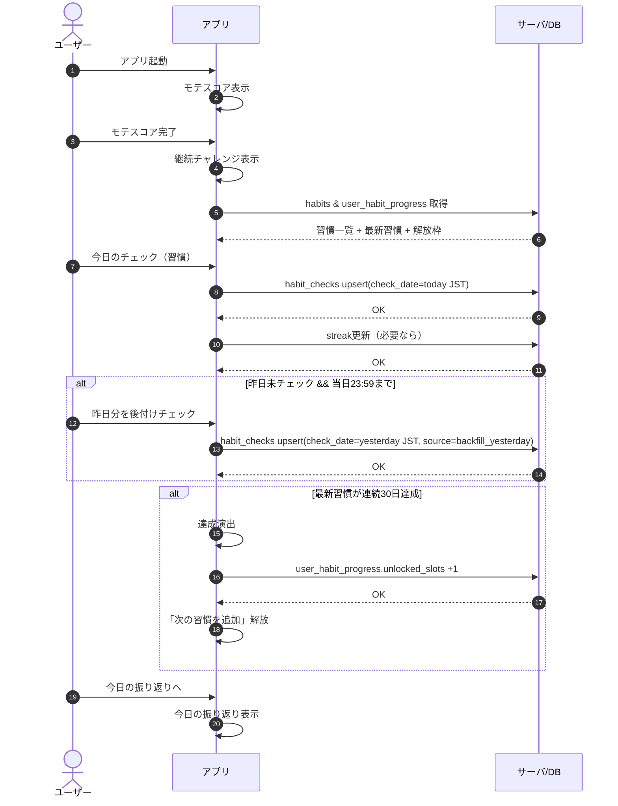

# 要件定義書（確定版）— 継続チャレンジ（習慣チェック）機能

## 1. 目的

既存アプリの導線「**モテスコア** → **継続チャレンジ** → **今日の振り返り**」に、習慣化の仕組みを追加し、

* 最初は1つに集中して続けられる
* 30日達成で“次の挑戦”が自然に始まる
* 達成済みの習慣も継続でき、積み上げが途切れない

という体験を提供する。

## 2. スコープ

### 対象

* 継続チャレンジ（習慣）作成・管理
* 日次チェック（当日）＋前日後付けチェック
* 連続日数管理（連続30日達成）
* 習慣枠解放（上限なし、順番攻略）

### 非対象（今回）

* モテスコアとの加点連動
* 今日の振り返りの内容連動
* 高度な頻度設定（週◯回、曜日指定など）

---

## 3. 仕様確定事項（前提）

* **日付基準：JST固定**（0:00〜23:59）
* **習慣の頻度：毎日固定**
* **達成条件：連続30日**
* **猶予：前日分のみ後付け可（当日23:59まで）**
* **表示：継続中の習慣はすべて同一画面でチェック可能**
* **独立性：モテスコア／今日の振り返りに影響しない**
* **枠解放条件：最新に追加した習慣のみが対象**
* **枠解放：30日達成ごとに +1（上限なし）**

---

## 4. 用語定義

* **最新習慣（チャレンジ対象）**：直近で追加され、次の枠解放条件になる習慣
* **継続中習慣（メンテ対象）**：過去に追加した習慣。チェックはできるが枠解放条件ではない
* **チェック**：その日分の実行記録（ON/OFF）
* **後付けチェック**：前日分を当日中（23:59まで）にチェックすること

---

## 5. ビジネスルール（最重要ロジック）

### 5.1 習慣枠（アンロック）

* 初期状態：作成可能な習慣枠は **1**
* 「最新習慣」が連続30日達成 → **作成枠 +1**
* 作成枠は減らさない（アーカイブしても戻らない）

### 5.2 新規習慣追加の制御（順番攻略）

* **最新習慣が未達成の間は新規追加できない**
* 最新習慣が達成されたら新規追加が可能になり、追加された習慣が次の「最新習慣」になる

### 5.3 連続の判定

* 連続対象は「期限内にチェックが存在する日」
* 前日後付けは **連続に含める**
* 期限を過ぎて未チェック日が確定したら、その時点で連続は途切れる

  * 最新習慣の連続日数は **0にリセット**し、次のチェック日から再スタート

### 5.4 後付け可能範囲

* 「昨日（前日）」のみ後付け可
* 本日23:59（JST）を過ぎたら前日は確定し、編集不可

---

## 6. 主要ユーザーフロー

1. アプリ起動
2. モテスコア完了
3. 継続チャレンジ画面表示
4. 継続中の習慣をワンタップでチェック（必要なら昨日分も後付け）
5. 今日の振り返りへ

---

## 7. 機能要件一覧

### 7.1 継続チャレンジ画面

* 継続中の習慣一覧を表示（すべて）
* 各習慣に以下を表示

  * 習慣名
  * 今日のチェック状態（ON/OFF）
  * 連続日数（例：連続12日）
* 「最新習慣」には進捗表示（例：12/30）
* 「昨日分が未チェック」なら、昨日チェック導線を表示

### 7.2 習慣管理

* 習慣作成

  * 初期は最大1件
  * 最新習慣達成時に枠が増え、追加可能
* 習慣編集

  * 名称変更
  * 並び替え（sort_order）
* 習慣アーカイブ

  * 非表示化（データ保持）
  * 解放枠は減らない

### 7.3 チェック記録

* 当日チェック：JST当日23:59まで編集可能
* 前日後付け：当日23:59までのみ可能
* チェックは **習慣×日付で1件**（重複禁止）

### 7.4 達成演出と解放

* 最新習慣が連続30日達成した時

  * 達成演出（祝福）
  * 習慣作成枠 +1
  * 「次の習慣を追加」導線を表示

---

## 8. 画面配置（ナビゲーション）

* **モテスコア画面 → 継続チャレンジ画面 → 今日の振り返り画面**
* 継続チャレンジはスキップ可能（※推奨：義務感を防ぐ）

---

## 9. データベース設計（テーブル構造）

| テーブル名               | 概要          | 主なカラム                                                                                                                                                                                                                                                                    |
| ------------------- | ----------- | ------------------------------------------------------------------------------------------------------------------------------------------------------------------------------------------------------------------------------------------------------------------------ |
| users               | ユーザー        | id(PK), created_at, updated_at                                                                                                                                                                                                                                           |
| user_habit_progress | ユーザーの習慣解放状態 | user_id(PK/FK), unlocked_slots(int, default=1), current_challenge_habit_id(FK, nullable), updated_at                                                                                                                                                                     |
| habits              | 習慣          | id(PK), user_id(FK), name, status(enum: challenge/maintenance/archived), sort_order(int), challenge_started_on(date), challenge_completed_on(date, nullable), current_streak(int), longest_streak(int), total_checks(int), archived_at(nullable), created_at, updated_at |
| habit_checks        | 日次チェック実績    | id(PK), habit_id(FK), check_date(date, JST), checked_at(datetime), source(enum: same_day/backfill_yesterday), created_at                                                                                                                                                 |

### 制約・インデックス（必須）

* `habit_checks`: **UNIQUE(habit_id, check_date)**
* `habits`: INDEX(user_id, status), INDEX(user_id, sort_order)
* `user_habit_progress`: FK(user_id) / FK(current_challenge_habit_id)

---

## 10. mermaid シーケンス図（主要フロー）

---

## 11. 受入基準（Acceptance Criteria）

* 初期状態で習慣は1件まで作成できる
* JSTで日付が切り替わる（端末TZに影響されない）
* 当日チェックは当日23:59まで編集可能
* 昨日分は当日23:59までのみ後付け可能
* 期限後の昨日分は編集できない
* 最新習慣が連続30日達成すると作成枠が+1される
* 枠解放判定は最新習慣のみ（他習慣の途切れは影響しない）
* 複数習慣を同一画面でチェックできる
* モテスコア／振り返りに加点などの影響がない

---
